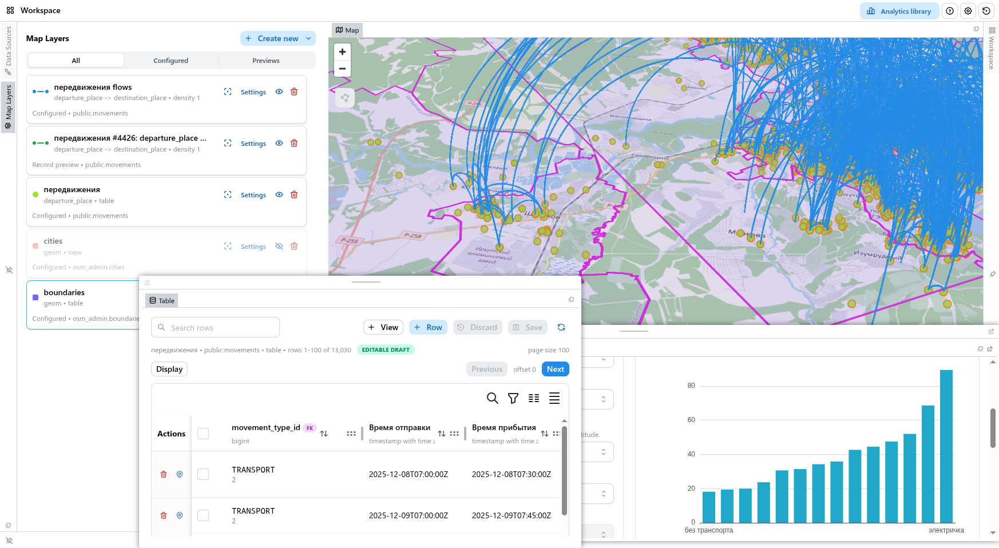

# GeoPanel

Совместная GIS-среда для работы с базами данных, картами, аналитикой и публичными дашбордами.



## Установка навыка для агента

Понадобятся доступ к приватному репозиторию, Git, Node.js и npm.

1. Клонируйте репозиторий и перейдите в его каталог:

   ```bash
   git clone 
   cd gis-service
   ```

2. Установите навык:

   ```bash
   npm run install:skill
   ```

   Команда копирует `geopanel-agent` сразу для двух агентов:

   - Codex: `$CODEX_HOME/skills/geopanel-agent`, либо `~/.codex/skills/geopanel-agent`
   - Claude Code: `$CLAUDE_CONFIG_DIR/skills/geopanel-agent`, либо `~/.claude/skills/geopanel-agent`

   Повторный запуск обновляет уже установленную версию навыка.

3. Создайте API-токен в разделе **Доступ к рабочей области** и сохраните его в отдельный файл:

   ```bash
   mkdir -p ~/.config/geopanel
   chmod 700 ~/.config/geopanel
   read -rsp "Токен GeoPanel: " geopanel_token
   printf '%s' "$geopanel_token" > ~/.config/geopanel/token
   unset geopanel_token
   chmod 600 ~/.config/geopanel/token
   ```

4. Перед запуском агента задайте адрес GeoPanel и путь к токену:

   ```bash
   export GEOPANEL_BASE_URL=https://geopanel.example.com
   export GEOPANEL_TOKEN_FILE="$HOME/.config/geopanel/token"
   ```

5. Перезапустите Codex или Claude Code, чтобы агент обнаружил навык.

Пример запроса: `Используй geopanel-agent, изучи мои наборы данных и создай дашборд.`
